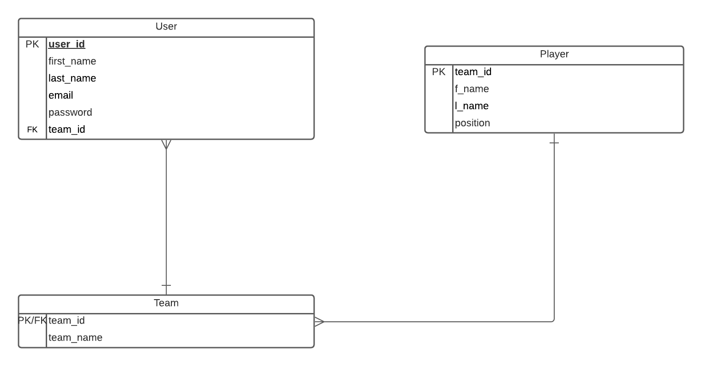

### Development Tools
- Visual Studio Code 
- Node.js
- SQLite
- Passport.js
- Chart.js
- Handlebars.js

# How to run application
```
$ npm start
```
Go to http://localhost:5000/

# Testing
```
$ npm test
```
# AWS Link
http://ec2-54-89-157-35.compute-1.amazonaws.com:5000/

### Test Implemented
1. Test that checks to see if all requiered fields for database table were inputted.
2. Test to check if the password is a "strong password" meaning there is at least one number, upper case and lower case letter.

### Planned Test
- Test routing, if a user tries to log in without an account. It should return the user to the create account page
- Check to see if there are any duplicate accounts in the database

### ER Diagram
The user-id is automatically assigned and incremented for each entry.



### Charting
We used chart.js bar chart to plot out the number of players playing a specific position on the NFL Chicago Bears football team.
The charts intention is to show the user how many position players are on a given team as stat line they can look at as a fan of that specific team.

### API Link
https://gist.github.com/nntrn/ee26cb2a0716de0947a0a4e9a157bc1c#teams-1

### Code Snippet of RESTFul API Connection

```javascript
axios.get("https://site.api.espn.com/apis/site/v2/sports/football/nfl/teams/3/roster").then(function(response){
    var object = response.data.athletes;
    var players = object[0].items;
    for(i = 0; i < object.length;i++){
        for(j=0; j < object[i].items.length;j++){
            var position = object[i].items[j].position.displayName;
            if (myMap.has(position)) {
                var counter = myMap.get(position);
                counter++;
                myMap.set(position,counter);
            } else {
                myMap.set(object[i].items[j].position.displayName, 1);
            }
        }
    }
    obj = Object.fromEntries(myMap)
    userId = user.id
    console.log(obj)
    res.render('../views/dashboard',{user, obj})

```


### Code Snippet of Docker config
```javascript
FROM node:12

WORKDIR /assignment-2---final-project-repository-group-14

COPY package*.json ./

RUN npm install 

COPY . .

ENV PORT 5000

EXPOSE 5000

CMD ["npm","start"]
```

